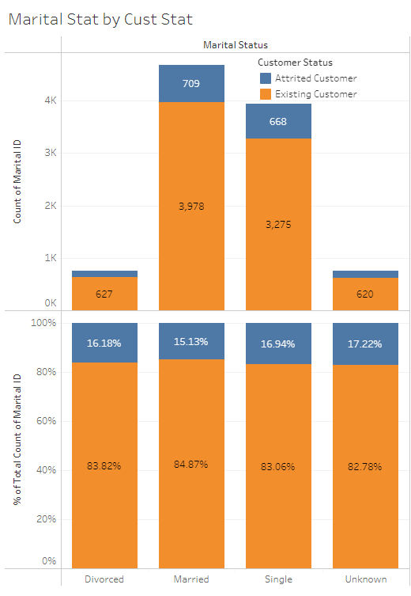

# Extract Transform Load using SSIS at Bank BTPN Syariah
This repository contains an ETL process using SQL Server Integration Service and scheduler for automation using Apache Airflow for Bank BTPN Syariah credit card customer. The project is designed to get a clean data that is consistent and reliable for analysis.

## Project Overview
This projects perform ETL process using SQL Server Integration Services start from extracting customer data from CSV flat file, then transform the data into clean data that is reliable for analysis and load this data into database and another CSV file to be used for analysis using Tableau.

## Tools and Technologies
- SQL Server Integration Service
- Apache Airflow
- Google Cloud Composer
- PostgreSQL
- Python
- Jupyter Notebook
- Pandas
- Tableau

## File Description
- `data_source/` : Folder containing raw data to be extracted.
- `data_destination/` : Folder containing clean data result of load process.
- `images/` : Folder containing images of data visualization, analysis result and logo of this project.
- `Rakamin_BTPN_Syariah.dtsx` : SQL Server Integration Service Package containing ETL process.
- `etl_btpns.py` : Airflow DAGs containing the code run SSIS package (.dtsx) automatically based on the schedule.
- `Final_Project_BTPN_Syariah_Presentation.pptx` : Project Presentation
- `Final Task_Bank BTPN Syariah_Data Engineer_Gilang Wiradhyaksa.pdf` : Rakamin Final Project Task

## SQL Server Integration Service
### Data Flow Task
Data Flow Task for Customer History, transformation process for customer history table and load it into CSV flat file and Microsoft SQL Server Database.
{:height="50%" width="50%"}

### SSIS Package
Multiple Data Flow Task are executed sequentially. Start from Customer History until Customer Status to transform and load data for all table.

## Apache Airflow
Airflow process to run SSIS package (.dtsx). This process automatically run everyday at 5am.

## Exploratory Data Analysis
To get an insight based on the data, we need to do data analysis. To achieve this we need data visualization and I do this using Tableau

### Data Connection
---

### Churn Distribution
---

- Churn customer for BTPN Syariah Credit Card customer is at 16.07%. 
- Considered bad because according to forbes.com the normal churn rate is 5-7%. 

### Income Category
---

- Most of the credit card customer is in low-income category. 
- Most churn customer is came from customer with under 5m per month. 

### Marital Status
---

- Most of the Credit Card customer is Single and Married. 
- Percentage of customer churn in each status is about the same at 15-17%.

### Dashboard
---

## Conclusion
- Based on the visualization we found that most of Bank BTPN Syariah Credit Card customer is came from people with income less than 5m per month.
- Also their most customer age is between 40 to 55 years old.
- The percentage of customer churn based on marital status is about the same. Means there is no correlation between churn and marital status.

## Suggestion
- For customer with high-income, giving a reward for using their credit card very often, so this customer will feel appreciated and respected. For high-income customer, appreciating them is more important rather than give them a discount or promotion.
- Whilst for low-income customer can give them a promotion/discount for a relatively low-cost item if they use credit card to attract them for using their credit card more.
- Do not make a promotion based on the marital status since there is no correlation between marital status and customer churn.
- Invest in providing exceptional customer service experiences. Ensure that customer support is easily accessible, responsive, and empathetic. Train representatives to address customer concerns effectively and resolve issues promptly.

## Acknowledgements
Project presentation can be seen at [Presentation](https://youtu.be/6J4IU2deZZw)  
Tableau Dashboard can be accessed as follows [Dashboard](https://public.tableau.com/profile/api/publish/BTPN_Syariah_Credit_Card_Customer/BTPNSCreditCardCustomer)

## Author
Gilang Wiradhyaksa | [Linkedin](https://www.linkedin.com/in/gilangwiradhyaksa/) | [GitHub](https://github.com/gilangwd)